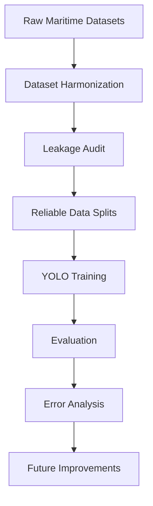

# EASY Project Progress Report

**Repository:** `easy-maritime-awareness`  
**Project:** `EASY` — `Environmental Awareness by the Sea and beYond`

This report summarizes the current state of the EASY project as a research progress deliverable. The goal is not only to show metrics, but to explain the problem, the decisions taken, the challenges encountered, the evidence collected so far, and the roadmap toward a more robust maritime awareness system.

## 1. Executive Summary

The EASY project aims to build a reproducible maritime awareness pipeline capable of detecting and, later, monitoring relevant objects in sea environments. The long-term target taxonomy includes `boat`, `ship`, `buoy`, `debris`, and `person`, across RGB imagery and future multimodal sensors.

The current project phase is a **dataset engineering and trustworthy baseline evaluation phase**. The active RGB branch currently focuses on `boat`, `ship`, and `buoy`, while `debris` and `person` are retained through the thermal companion track based on MassMIND.

### Current status

- The taxonomy is frozen and the data pipeline is implemented.
- Official datasets have been selected, staged, converted, and exported into derived EASY datasets.
- Multiple RGB baselines have been trained and audited.
- Leakage was discovered in the original split and corrected through pseudo-sequence-aware auditing.
- `ship` is currently the strongest class.
- `boat` is usable but still sensitive to split design.
- `buoy` remains the main bottleneck.

### Key achievements

- Established a reproducible dataset-first workflow.
- Built leakage-aware `clean`, `balanced-v1`, and `balanced-v2` splits.
- Identified that the `buoy` problem is primarily a data coverage and semantic ambiguity problem, not only a model problem.
- Produced detailed `boat` vs `buoy` forensic analysis showing that many buoy instances are localized but classified as `boat`.

### Current limitations

- Only five buoy-bearing pseudo-sequences exist in the RGB dataset.
- Buoy diversity is insufficient for robust held-out generalization.
- `boat` and `buoy` have a fragile semantic boundary under the current data regime.
- The project is not yet ready to claim a fully stable operational RGB benchmark.

## 2. Project Evolution Timeline

The project has evolved through a sequence of increasingly rigorous phases. This timeline is useful because it shows that the current baseline did not emerge from a single training run, but from a structured research process that progressively improved data trustworthiness and problem understanding.

### Phase 1 — Dataset collection and harmonization
Official maritime datasets were selected, mapped to the EASY taxonomy, and converted into a unified working format.

### Phase 2 — Dataset audit and leakage detection
Early high metrics triggered a deeper audit, which revealed that pseudo-sequence leakage was inflating the apparent performance.

### Phase 3 — Creation of reliable train / validation / test splits
Leakage-aware `clean`, `balanced-v1`, and `balanced-v2` splits were created to make evaluation more realistic and scientifically defensible.

### Phase 4 — Baseline YOLO training and evaluation
Multiple `YOLOv8n` baselines were trained to establish a lightweight, deployment-aware reference detector.

### Phase 5 — Error analysis and bottleneck identification
Confusion analysis and qualitative inspection showed that `buoy` is not simply missed, but often confused with `boat`, especially in small-object regimes.

### Phase 6 — Current research assessment and planning
The project now has a trustworthy baseline, a reliable audit methodology, and a clear understanding of the main bottlenecks.

### Phase 7 — Next research step
The next phase is to improve `buoy` recognition through data refinement, coverage expansion, and small-object-focused experimentation.

## 3. Project Workflow

The current EASY workflow can be summarized as a compact research pipeline from raw data to evidence-driven next steps.



### Stage interpretation

- **Raw Maritime Datasets.** The project starts from heterogeneous official sources with different modalities, annotation conventions, and strengths.
- **Dataset Harmonization.** These sources are staged, mapped, and converted into a common EASY-compatible format.
- **Leakage Audit.** Pseudo-sequence relationships are inspected to prevent train/validation/test contamination.
- **Reliable Data Splits.** Clean and balanced splits are built to support trustworthy comparison.
- **YOLO Training.** Lightweight pretrained baselines are trained as a fast and deployment-aware reference.
- **Evaluation.** Global and per-class metrics reveal which parts of the task are genuinely solved and which are not.
- **Error Analysis.** Confusion matrices and qualitative overlays identify semantic and small-object failure modes.
- **Future Improvements.** The roadmap is derived from evidence, not from model-scaling assumptions alone.

This workflow helps a new reader understand the project in one pass: EASY is not just training detectors, but building a reliable perception pipeline whose conclusions can be trusted.

## 4. Project Context

The EASY project addresses the broader problem of **maritime environmental awareness**: building a system that can perceive and reason about relevant foreground entities in realistic sea scenes.

This is important because maritime scenes are difficult in ways that are not fully captured by generic object detection benchmarks:
- small objects at long range
- cluttered water backgrounds
- glare and reflections
- waves and wake artifacts
- strong weather and illumination variability
- visual overlap between semantically different floating objects

The long-term vision is a maritime awareness system capable of detecting and monitoring:
- `boat`
- `ship`
- `buoy`
- `debris`
- `person`

using RGB imagery now, and future multimodal sensors later, including thermal and potentially stereo-based sensing.

### Expected final system

```text
EASY System
├── RGB perception
│   └── boat / ship / buoy
├── Thermal companion perception
│   └── debris / person
├── Future tracking layer
│   └── object persistence over time
└── Future embedded deployment
    └── edge-ready maritime awareness
```

## 5. Dataset Analysis

The current EASY scope is built on three official datasets:
- `SMD`
- `SeaShips`
- `MassMIND`

Each was selected for a specific role, not simply for size.

### SMD

`SMD` is the primary RGB dataset. It is indispensable because it is the only source that currently contributes meaningful `buoy` evidence, and it also provides SMD-style `boat` scenes that are visually distinct from SeaShips.

**Advantages**
- only meaningful source of `buoy`
- useful `boat` context
- natural sequence structure, which is critical for leakage-aware splitting

**Limitations**
- limited buoy-bearing pseudo-sequences
- insufficient internal buoy diversity
- weaker `ship` support than SeaShips

### SeaShips

`SeaShips` is the support RGB dataset. It strengthens `ship` coverage and contributes many vessel scenes, including additional `boat` examples.

**Advantages**
- strong `ship` coverage
- large number of vessel scenes
- useful support for `boat` / `ship` discrimination

**Limitations**
- does not contribute `buoy`
- many pseudo-sequences are nearly monoclasse `ship`

### MassMIND

`MassMIND` is retained as a **thermal companion dataset**. It is important because the official EASY taxonomy includes `debris` and `person`, but it is intentionally kept separate from the main RGB baseline.

**Advantages**
- thermal evidence for future multimodal work
- useful for `debris` and `person`
- keeps the broader EASY taxonomy meaningful

**Limitations**
- not suitable for direct mixing into the first RGB baseline
- requires modality-aware interpretation and careful mapping

### Why these datasets were selected

The selection is driven by task coverage:
- use `SMD` because `buoy` only exists there
- use `SeaShips` because `ship` coverage is much stronger there
- keep `MassMIND` because EASY is broader than RGB-3 and must retain `debris` / `person`

### Dataset composition

Current RGB-3 statistics from `outputs/dataset_analysis/rgb3/dataset_statistics.md`:

| Split | Images | Labels | Labels With Objects | Empty Labels |
| --- | ---: | ---: | ---: | ---: |
| train | 4172 | 4172 | 4172 | 0 |
| val | 2430 | 2430 | 2430 | 0 |
| test | 3843 | 3843 | 3843 | 0 |

Current RGB-3 class distribution:

| Class | Count | Percentage |
| --- | ---: | ---: |
| `boat` | 3663 | 26.71% |
| `ship` | 7031 | 51.27% |
| `buoy` | 3021 | 22.03% |

**Interpretation.**  
At the aggregate class-count level, the RGB-3 dataset does not look catastrophically imbalanced. `ship` is dominant, but `boat` and `buoy` are not rare in absolute count. This is important because it shows that the main problem is **not simple global class frequency**.

However, class counts alone are misleading. The key issue is how those counts are distributed across pseudo-sequences and visual regimes.

### Thermal companion class distribution

MassMIND thermal class distribution from `outputs/dataset_analysis/massmind_thermal/class_balance_report.md`:

| Class | Count | Percentage |
| --- | ---: | ---: |
| `boat` | 0 | 0.00% |
| `ship` | 0 | 0.00% |
| `buoy` | 0 | 0.00% |
| `debris` | 7103 | 62.15% |
| `person` | 4325 | 37.85% |

**Interpretation.**  
This confirms that MassMIND is not part of the active RGB detection baseline, but it is still strategically important. It supplies the thermal evidence needed to keep `debris` and `person` in the overall EASY roadmap.

### Visual dataset examples

| Example | Preview | What it shows |
| --- | --- | --- |
| SMD buoy-rich scene |  | Small-object buoy regime in RGB maritime context |
| SMD mixed scene |  | The only meaningful mixed `boat` + `buoy` pseudo-sequence |
| SeaShips vessel scene |  | Strong ship-heavy maritime coverage from SeaShips |

**Interpretation.**  
These examples illustrate why the RGB branch requires both SMD and SeaShips. SMD contributes buoy-specific evidence and real mixed context; SeaShips contributes stronger vessel support, especially for `ship`.

| Example | Preview | What it shows |
| --- | --- | --- |
| MassMIND thermal example |  | Thermal-style object evidence for the non-RGB branch |
| MassMIND validation example |  | Companion modality for `debris` / `person` roadmap |

**Interpretation.**  
These thermal examples show that EASY is not just an RGB object detection project. The repository already prepares the ground for multimodal perception, even though the current trustworthy baseline work remains RGB-first.

This dataset analysis naturally leads to model selection. Once the team understood which classes were available, how they were distributed, and where the real scarcity lived, the next question became which detector family could provide a credible, deployment-aware baseline for this data regime.

## 6. Model Selection

### Why YOLO was selected

YOLO was selected because the project is not only about offline accuracy; it is also about building toward a future deployable maritime awareness system.

The main reasons are:
- **real-time inference potential**
- **lightweight architecture family**
- **good ecosystem support**
- **strong baseline for embedded deployment**
- **compatibility with future Raspberry Pi-oriented experiments**

### Why this matters for EASY

For EASY, model choice must remain aligned with system constraints:
- future edge deployment matters
- real-time awareness is more relevant than pure benchmark chasing
- the maritime environment benefits from models that can run frequently and consistently

### Research interpretation

YOLO is therefore not presented as “the perfect final architecture”, but as a rational baseline family for:
- rapid iteration
- deployment-aware experimentation
- early-stage dataset diagnosis

This is especially important because the current bottleneck appears to be data quality and coverage rather than pure model expressiveness.

With that motivation in place, the next step is the training pipeline itself: not just how the model is optimized, but how the dataset is staged, split, and evaluated so that the resulting numbers can be defended in a research setting.

## 7. Training Pipeline

The repository is built around a **dataset-first training pipeline**.

### Preprocessing

The project uses controlled staging and conversion before training:
- official datasets are staged explicitly
- provenance is preserved
- data is converted to intermediate normalized records
- YOLO export happens only after mapping validation

**Why this was done.**  
This prevents silent class coercion and makes the data pipeline auditable, which is essential once split quality becomes part of the scientific result.

### Augmentation

The current baseline relies on standard YOLO augmentation behavior rather than aggressive custom augmentation.

**Why this choice was made.**  
At this stage the project needed a clean baseline that isolates dataset issues. Heavy augmentation would have made it harder to determine whether failures came from the model, the data, or the augmentation policy.

### Train / validation / test strategy

The most important design decision in the pipeline was the move to **pseudo-sequence-aware splitting**:
- SMD frames are grouped by their source video
- SeaShips images are grouped into larger pseudo-sequence blocks
- no pseudo-sequence is allowed to appear in more than one split

**Why this matters.**  
This is the key methodological improvement of the project. Without it, metrics can look excellent while reflecting leakage rather than true generalization.

### Training strategy

The project uses `YOLOv8n` pretrained baselines as a lightweight and deployment-aware starting point. This allows the team to:
- validate the dataset engineering stack
- obtain fast feedback
- study failure modes before scaling model size

### Evaluation metrics

The primary quantitative metrics are:
- Precision
- Recall
- mAP50
- mAP50-95

**Why these metrics were used.**  
They provide a compact but informative view of:
- how often predictions are correct
- how often objects are missed
- how localization and class confidence interact across thresholds

With the pipeline established, the results section can be read as a true evaluation outcome rather than a raw training log. The question is no longer whether a model converged, but whether the split and metrics reveal meaningful maritime perception behavior.

## 8. Results

### Quantitative Results

#### Global baseline comparison

| Split / baseline | Precision | Recall | mAP50 | mAP50-95 | F1 |
| --- | ---: | ---: | ---: | ---: | ---: |
| `rgb3` | 0.96140 | 0.94657 | 0.98036 | 0.77264 | 0.95393 |
| `clean` | 0.87665 | 0.49337 | 0.51615 | 0.31597 | 0.63140 |
| `balanced-v1` | 0.58949 | 0.36423 | 0.38999 | 0.24078 | 0.45026 |
| `balanced-v2` | 0.89154 | 0.41673 | 0.43560 | 0.27231 | 0.56797 |

**What do these numbers mean?**  
The original `rgb3` metrics were too optimistic because of leakage. Once leakage was reduced, performance dropped sharply, revealing the true difficulty of the task. `clean` exposed the buoy collapse, `balanced-v1` improved buoy but damaged boat, and `balanced-v2` restored a healthier train regime while remaining a hard and realistic evaluation split.

#### Current per-class result on `balanced-v2`

| Class | Precision | Recall | mAP50 | mAP50-95 | F1 |
| --- | ---: | ---: | ---: | ---: | ---: |
| `boat` | 0.76176 | 0.38017 | 0.43031 | 0.23984 | 0.50720 |
| `ship` | 0.87924 | 0.83755 | 0.86697 | 0.58144 | 0.85789 |
| `buoy` | 1.00000 | 0.00000 | 0.06412 | 0.02946 | 0.00000 |

**What do these numbers mean?**  
`ship` is clearly the most stable and learnable class. `boat` works at a moderate level, but still shows a large miss rate. `buoy` remains the major failure case: the model can sometimes rank buoy predictions, but it does not produce operationally usable buoy recall on the held-out `balanced-v2` validation regime.

### Qualitative Results

#### Best detections

| Example | Preview | Meaning |
| --- | --- | --- |
| Validation prediction panel |  | Shows that the detector can handle many large vessel cases and some easier scenes well |

**Interpretation.**  
The model is already capable of useful vessel detection in typical maritime imagery. This is why `ship` remains strong and why the overall project should not be described as failing globally.

#### Typical detections

| Example | Preview | Meaning |
| --- | --- | --- |
| Another validation prediction batch |  | Represents average behavior rather than only best-case examples |

**Interpretation.**  
Typical behavior is mixed: ships are often detected reliably, boats are partially detected, and small / ambiguous floating objects remain much less stable.

#### Difficult detections

| Example | Preview | Meaning |
| --- | --- | --- |
| Challenging validation panel |  | Demonstrates the type of scenes where small-object and semantic failures are more visible |

**Interpretation.**  
The hardest scenes are not simply “bad images”; they are scenes where the target is small, visually ambiguous, or under-represented in train. This is exactly the regime where `buoy` becomes the bottleneck.

These result patterns motivate the next section directly. Aggregate metrics identify that `buoy` is failing, but they do not yet explain why. For that, the project needs confusion analysis and targeted qualitative inspection.

## 9. Error Analysis

This is the most important section of the current report.

The key project result is not just a metric value, but a **diagnosis**:
- many buoy instances are spatially localized
- but the model often classifies them as `boat`

### Confusion evidence


**Interpretation.**  
The confusion matrix is consistent with the later forensic analysis: the main buoy failure is not random background noise, but systematic confusion with another foreground class, especially `boat`.

### Dedicated boat-vs-buoy forensic result

From `outputs/reports/boat_vs_buoy_error_analysis.md`:
- `423 / 600` validation buoy are matched as `boat`
- `93 / 600` are matched as low-confidence `buoy`
- `83 / 600` are missed as background
- `0 / 600` are matched as confident `buoy`

### Visual examples of the major error modes

| Error mode | Preview | Why it matters |
| --- | --- | --- |
| GT buoy predicted as `boat` |  | The object is visible and localized, but classified as the wrong foreground class |
| GT buoy predicted as low-confidence `buoy` |  | The detector is uncertain even when the object is localized as buoy |
| GT buoy missed as background |  | Small-object and confidence failures still exist beyond pure class confusion |

**Interpretation.**  
These examples show three different failure modes. The most important one is the first: the object is not invisible, but semantically misclassified. That makes the buoy problem much more interesting than a simple detection-threshold problem.

### Why does this happen?

#### False positives and ambiguous detections

`boat` vs `buoy` confusion suggests that:
- some floating objects share similar silhouettes
- some train `boat` examples occupy the same small-object regime
- the semantic boundary is fragile under current data coverage

#### False negatives

Missed buoy cases indicate:
- small-object detection remains difficult
- some scenes still fall below the model’s effective confidence regime

#### Low-confidence detections

Low-confidence buoy matches show that:
- the model sometimes “almost knows” the correct class
- but the training data does not support stable buoy scoring under held-out conditions

### Evidence-supported explanation

The strongest evidence points to a combination of:
1. **class scarcity in the right visual regime**
2. **pseudo-sequence scarcity**
3. **subtype shift inside `buoy`**
4. **semantic overlap with `boat`**

### Possible future solutions

- targeted buoy data expansion
- stricter label cleaning policy
- better coverage of large navigation-marker buoy
- training schemes designed for small-object regimes

This error analysis provides the bridge to the remainder of the report. The following assessment, lessons learned, and future work are grounded in these failure modes rather than in generic detector-improvement ideas.

## 10. Challenges Encountered

### Challenge 1 — Class imbalance

At the aggregate class-count level, imbalance is not catastrophic. However, class balance becomes misleading once the data is grouped by pseudo-sequence and visual subtype.

**Why this matters.**  
The project learned that “count balance” is weaker than “coverage balance”.

### Challenge 2 — Boat vs buoy visual similarity

This is currently the most important semantic challenge. Many buoy instances are visible but classified as boat, suggesting that the learned class boundary is not stable enough.

### Challenge 3 — Small object detection

Many buoy are small, distant, or low-profile floating objects. Even when the model sees them, confidence can be low and semantic separation can be weak.

### Challenge 4 — Environmental variability

Maritime scenes are strongly affected by:
- reflections
- waves
- wake patterns
- illumination changes
- visibility changes
- scene clutter

These factors amplify small-object difficulty and increase ambiguity near the waterline.

### Challenge 5 — Dataset limitations

The current dataset has several limitations:
- only five buoy-bearing pseudo-sequences
- many sequences are nearly monoclasse
- annotation quality likely needs targeted review for `boat` vs `buoy`
- train coverage does not fully represent held-out buoy styles

## 11. Lessons Learned

The project has already produced several practical lessons:

- Dataset quality matters more than model complexity.
- Leakage-aware evaluation is essential.
- Error analysis is more informative than a single aggregate metric.
- Small objects remain the most difficult category.
- Maritime environments introduce unique challenges that generic object detection summaries can hide.
- A larger model is not the first solution when the failure is semantic or dataset-driven.

## 12. Current Assessment

This section is intentionally critical and not overly optimistic.

### Project Status Overview

| Component | Status |
| --- | --- |
| Dataset Pipeline | Completed |
| Data Quality Audit | Completed |
| Baseline Detector | Completed |
| Quantitative Evaluation | Completed |
| Error Analysis | Completed |
| Boat Recognition | Moderate |
| Buoy Recognition | Needs Improvement |
| Object Tracking | Not Started |
| Thermal Integration | Not Started |
| Raspberry Pi Deployment | Not Started |

**Interpretation.**  
This table shows that the project is already mature from a research-process perspective: the pipeline, audit, baseline, and evaluation stack are in place. What remains immature is not the existence of a method, but the robustness of specific perception capabilities, especially `buoy` recognition.

### What works well

- the taxonomy and dataset policy are clear
- the engineering pipeline is reproducible
- `ship` works well
- the project now has a trustworthy evaluation methodology

### What partially works

- `boat` has become usable again on `balanced-v2`
- the RGB branch is strong enough to support meaningful iteration and future deployment experiments

### What does not yet work

- `buoy` does not yet generalize robustly
- current splits still expose major buoy fragility
- the project cannot yet claim stable multi-class maritime awareness on the RGB branch alone

The transition from assessment to future work is therefore straightforward: the next actions should reinforce what is already methodologically strong while directly addressing the specific buoy and small-object weaknesses identified by the analysis.

## 13. Future Work

### Phase 2 — Dataset refinement

- relabel verification
- class balancing at the pseudo-sequence level
- targeted augmentation only after dataset issues are better controlled

### Phase 3 — Small object optimization

- higher resolution training
- image tiling
- architecture changes only after the data bottleneck is better characterized

### Phase 4 — Object tracking

- DeepSORT
- ByteTrack

### Phase 5 — Multimodal perception

- RGB camera
- thermal camera
- stereo vision

### Phase 6 — Raspberry Pi deployment

- model optimization
- edge inference
- real-time testing

## 14. Alignment with EASY Project Objectives

The work completed so far contributes directly to the broader EASY vision, even though the current detector is only the first operational component of that system.

### 1. Maritime environmental awareness
The project has already established a perception baseline tailored to realistic sea scenes rather than generic object-detection benchmarks. This is a necessary foundation for any future maritime awareness stack.

### 2. Object recognition
A trustworthy RGB detector for `boat`, `ship`, and `buoy` is now in place as a measurable baseline. Even where performance is limited, the project now knows which recognition capabilities are stable and which are still fragile.

### 3. Modular perception systems
The repository has been structured as a modular pipeline: staging, conversion, validation, split construction, training, and audit are separated clearly. This makes the system easier to extend and scientifically easier to inspect.

### 4. Future multimodal sensing
By keeping MassMIND as a thermal companion rather than forcing an early merge, the project preserves a realistic path toward multimodal maritime sensing without contaminating the current RGB analysis.

### 5. Future RGB + Thermal integration
The current RGB branch identifies what is already possible with standard visible imagery and where it fails. This is strategically valuable because future RGB + thermal fusion can now be motivated by demonstrated bottlenecks rather than by vague architectural ambition.

### 6. Future embedded deployment
The use of a lightweight YOLO baseline keeps the work aligned with edge-oriented deployment goals, including Raspberry Pi experimentation. The current detector is therefore not just a research artifact; it is the first practical building block of a broader deployable awareness system.

Overall, the present phase should be viewed as foundational. It does not complete the EASY vision, but it establishes the methodological and empirical base on which the larger maritime awareness system can be built.

## 15. Final Conclusions

The current EASY phase has produced more than a set of detector metrics. It has delivered a **trustworthy research baseline**, a reproducible data pipeline, and a clear empirical understanding of where the maritime perception problem is genuinely hard.

The most important achievements are methodological as well as technical:
- the taxonomy has been frozen and documented
- the dataset pipeline has been implemented end-to-end
- multiple split strategies have been audited
- leakage has been detected and corrected
- pseudo-sequence-aware evaluation has been established as the project standard
- `boat`, `ship`, and especially `buoy` have been analyzed quantitatively and qualitatively

This rigor matters because it makes the current baseline scientifically credible. The original optimistic results could have led to misleading conclusions, but the leakage audit transformed them into an upper bound and replaced them with a more defensible evaluation regime. As a result, the project can now distinguish between apparent performance and real generalization.

The central scientific finding is also clear: `buoy` is the dominant bottleneck, and it fails for understandable reasons. The evidence points to a combination of pseudo-sequence scarcity, limited subtype diversity, small-object difficulty, and semantic overlap with `boat`. This means the project is no longer guessing about the source of the problem; it has identified it with concrete supporting evidence.

At the same time, the current state is encouraging. `ship` is stable, `boat` is usable, the baseline is lightweight and deployment-aware, and the full workflow from dataset preparation to error analysis is operational. The roadmap is therefore no longer speculative. It is evidence-driven and naturally prioritizes buoy data quality, buoy coverage, semantic cleanup, and small-object-focused refinement before more aggressive model scaling.

**The project has successfully established a solid baseline and identified the most critical bottlenecks, providing a clear path toward a robust maritime awareness system.**
